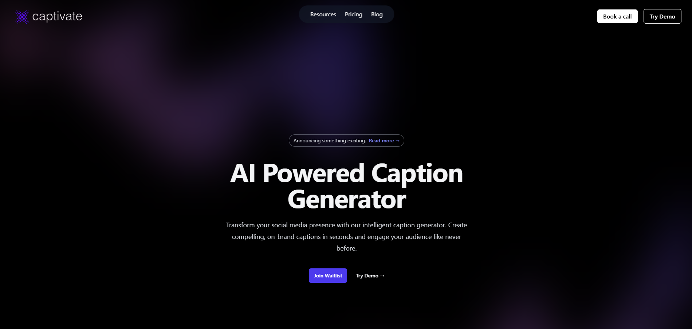
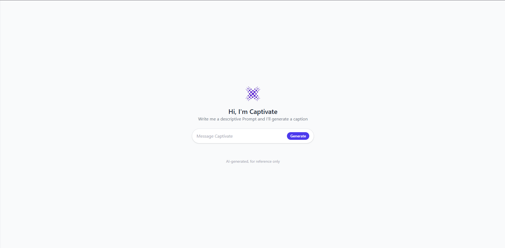

# Captivate: AI Social Media Caption Generator

**Deployed App**: [Captivate Demo](https://caption-generator-2bjwemfqx-omar-almes-projects.vercel.app)






## Project Description
Captivate is a React + Vite application that generates up to five short, catchy social media captions using an AI-powered endpoint. Users can:
- Write a descriptive prompt.
- Receive exactly five AI-generated captions.
- “Favorite” any caption for later reference.
- View and remove favorited captions in a separate Favorites page.

The project uses **Tailwind CSS** for styling, **React Router** for navigation, and **OpenRouter** for the AI endpoint.

## Features
1. **Responsive Landing Page**: A modern one-page introduction with a dark or light theme.
2. **AI Chat Layout**: A minimal chat input (ChatBubble) to enter prompts, returning multiple lines of captions.
3. **Favorites System**: Click a star icon to save captions.
4. **Favorites Page**: View and remove favorited captions.
5. **Integration with OpenRouter**: A free-tier AI endpoint that returns exactly five captions.

## Installation & Setup
1. **Clone the repository**:
   ```bash
   git clone https://github.com/your-username/caption-generator.git
   cd caption-generator

2. **Install dependencies**:
   ```bash
   npm install
   ```

3. **Generate a secret key from this link**:
   ```bash
   https://openrouter.ai/deepseek/deepseek-r1:free/api

4. **Create a .env file in project root and add:**:
   ```bash
   VITE_OPENROUTER_API_KEY=your-openrouter-api-key
   ```

5. **Start the development server**:
   ```bash
   npm run dev
   ```

### G-Krav:

- **`[✔️]`**: Projektet innehåller och använder minst 6 stycken komponenter varav minst 2 stycken är “statefulla"-komponenter.

- **`[✔️]`**: React Router har använts för att dynamiskt uppdatera URL’en.

- **`[✔️]`**: Git & GitHub

- **`[✔️]`**: README-fil.

- **`[✔️]`**: Presentation.


### VG-Krav:

- **`[✔️]`**: CSS i JS: Two Styled Components

- **`[✔️]`**: OpenRouter API.


## Enjoy Captivate!
Feel Feel free to open issues or PRs for enhancements, bug fixes, or AI improvements. Feedback is always welcome.
